# Curso de CSS Avanzado y Sass - Flex-blox, Grid, Animaciones - Inicio: 25/06/2024

## Natours

### Reset correcto de CSS para los navegadores

Los navegadores suelen tener sus propias reglas css y esto genera un inconveniente de no poder crear una web igual para todos los navegadores, entonces se aplica un reset de css para hacer que la web se vea igual en todos los navegadores.

Se usa la siguiente regla css:

### Definiendo la tipografía para todo el proyecto

Desde un inicio podemos elegir la tipografía, color de texto, tamaño de fuente, grosor de fuente y separación entre lineas desde el selector `body`.

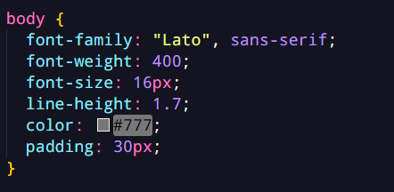

### Clip-path

Podemos utilizar esta propiedad CSS para recortar imágenes o dar forma geométrica a nuestro elementos html.

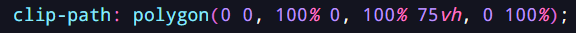

### Position Absolute

Con esta propiedad css podemos posicionar elementos dentro de un contenedor de forma libre. El elemento que es posicionado sale del flujo apilado de elementos.

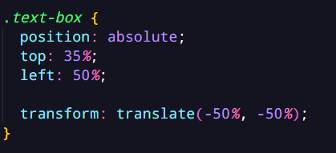

### Key-Frames

Podemos añadir animaciones complejas con esta función de CSS. Permiten especificar estados intermedios de una animación a lo largo de su duración.

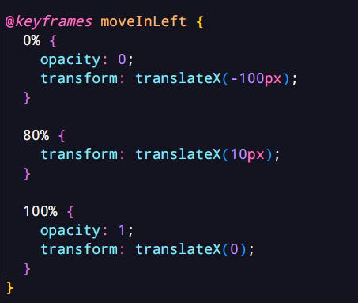

Forma de aplicar a un elemento dicha animación.

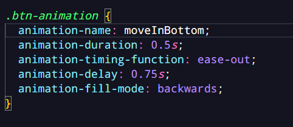

`animation-backwards` hace que desde un comienzo el elemento tenga el css del 0% respetando el `animation-delay` para comenzar la animación.

### Pseudo Elementos - Pseudo Clases

Las pseudo-clases son un estado especial de un selector, actuando como condicional.

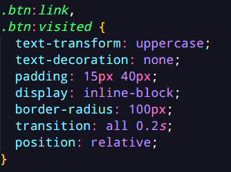

Los pseudo-elementos son elementos virtuales creados desde css que se posicionan después del elemento al que se le crea, se les puede personalizar como cualquier elemento.

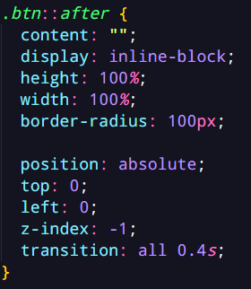

### Propiedad transition

Podemos usar transition para que los cambios de css se hagan de forma animada y suave.

## ¿Como funciona CSS?

### Tres pilares para escribir buen código CSS y HTML.

1. Responsive Design:

Diseños fluidos, media queries, imágenes responsivas, uso de unidades responsivas, practicar desktop first vs mobile first.

2. Código mantenible y escalable:

Código limpio, fácil de entender, escalable, reusable, archivos organizados, nombramientos de clases y buen estructurado del HTML.

3. Rendimiento de una web:

Minimizar la peticiones http, el código, comprimir el código, usar pre-procesadores de css (SASS), minimizar imágenes, comprimir imágenes.

### ¿Cómo funciona CSS detrás de escena?

¿Qué pasa cuando con el código de css cuando carga la página web?

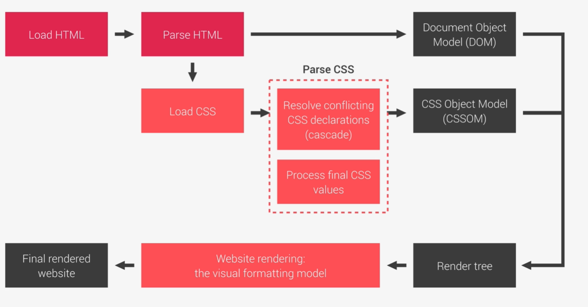

Cuando el CSS es cargado pasa por 2 procesos o 2 pasos, el procesa de resolver conflictos de declaraciones css y el procesamiento de valores finales en CSS.

Cuando resolvemos conflictos usamos un proceso llamado "Cascada", este proceso se encarga de combinar diferentes estilos resolviendo conflictos entre diferentes reglas CSS que son aplicas a cierto elemento.

1. ¿Cómo hacer el proceso de cascada para resolver los conflictos?

Toma en cuenta la importancia, luego la especificidad y al final el orden del código escrito.

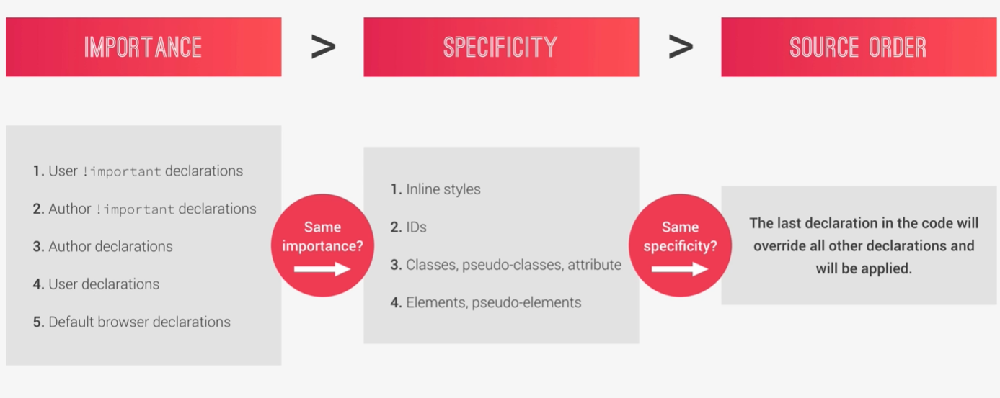

2. ¿Cómo procesa los valores CSS?

Unidades:

- <strong>%</strong> en tamaño de elemento: los porcentajes lo calcula teniendo en cuenta al ancho del elemento padre.
- <strong>%</strong> en tamaño de fuente: los porcentajes se calculan teniendo en cuenta el tamaño de fuente del elemento padre.
- <strong>em</strong> en tamaño de fuente: Se calcula teniendo en cuenta al elemento padre inmediato.

- <strong>rem</strong>: se calcula teniendo en cuenta el elemento raíz (<hml>).

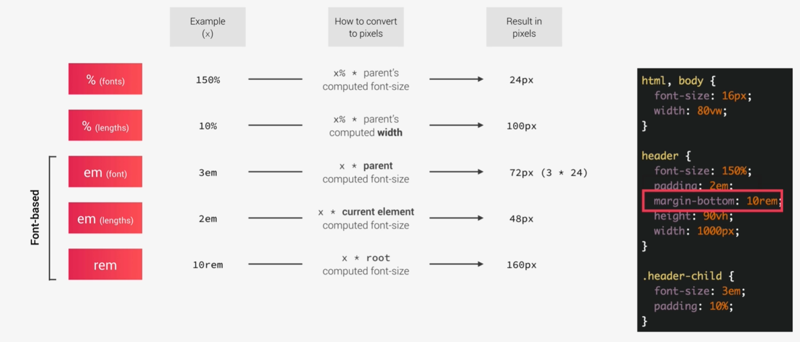

3. Herencia en CSS

Existe propiedades que se heredan en css del elemento padre al elemento hijo, como las propiedades de tipografía. La herencia es bastante intuitiva en CSS por la que no es realmente compleja.

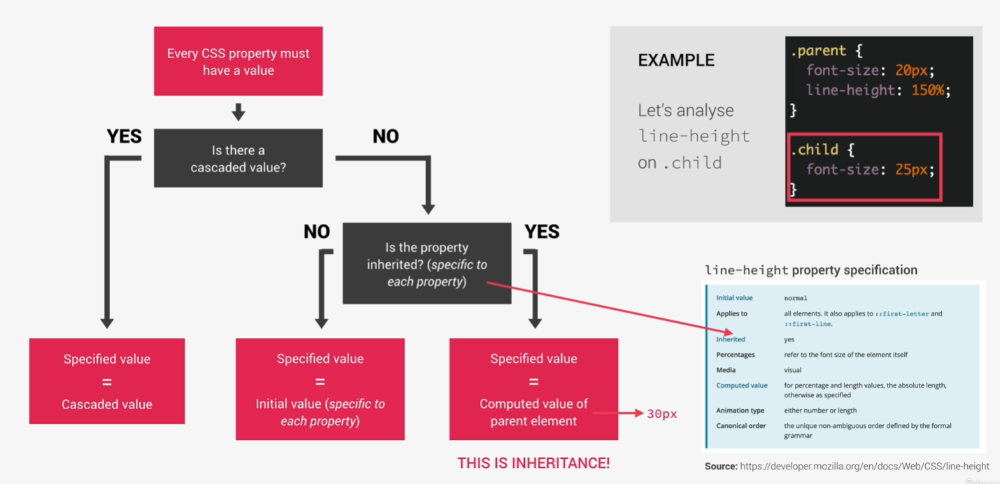

### ¿Cómo CSS renderiza una web?

Después de los de los procesos de CSS viene lo que es el modelo de formato visual CSS, que es un algoritmo que calcula las cajas y determina el diseño de las cajas para cada elemento en el árbol de representación con el fin de determinar el diseño final de la página.

El algoritmo tiene en cuenta los siguientes factores:

- Tamaño de cajas: el modelo de caja
- Tipo de caja: En linea, bloque, en linea y bloque.
- Esquema posicional: flotantes y posicionamientos.
- Apilado de contextos
- Otros elementos del árbol.
- Tamaño del viewport, dimensiones de imágenes, etc.

### Arquitectura CSS, componentes y metodología BEM

¿Cómo debemos pensar en los diseños y como debemos pensar en nuestro código?

Una buena mentalidad a la hora de crear proyectos, es <strong>pensar</strong>, <strong>construir</strong>, <strong>arquitectura</strong>.

Pensar: Antes de construir la página debemos pensar en el diseño.

Para eso podemos usar el principio <strong>component-drive design</strong>, basado en:

- Separar en bloques cada parte de la web.
- Colección de componente unidos para el diseño general de la página.
- Reutilizabas para el proyecto y diferentes proyectos.
- Deben ser independientes.

Construir: Necesitamos una buena estrategia y estructura consistentes para nombrar nuestras clases. Uno de las mejores es el metodo BEM:

- Block Element Modifier
- Block: Componente independiente que es significativo por sí mismo.
- Element: Parte del bloque que no tiene significado por sí mismo.
- Modifier: Una versión diferente del elemento.

Arquitectura:

También debemos tener una buena estructura de carpetas donde estarán nuestros archivos CSS.

Una buena solución sería el patrón 7-1, siete diferentes carpetas y un solo archivo principal.

## Introducción a SASS

SASS es un pre-procesador de CSS, una extensión de CSS que añade funciones y características al lenguaje.

Características que SASS nos da:

- Variables: valores reutilizables como colores, tamaños y espaciados, etc.
- Nesting: Anidamiento de selectores, permitiendo escribir menos código.
- Operadores: Podemos hacer cálculos matemáticos en CSS.
- Imports: Podemos escribir CSS en diferentes archivos y unir todos en un solo archivo.
- Mixins: Podemos escribir código CSS reutilizable.
- Funciones: Similar a los mixins pero este produce un valor que podemos usar.
- Extends: Se pueden usar para hacer que diferentes selectores hereden declaraciones que son comunes a ellos.
- Control de directivas: para escribir codigo complejo usando condicionales y bucles.

### Implementando patron 7 - 1 en SASS

Ayuda muchísimo organizando nuestros archivos SCSS, lo hace mantenible, escalable y mucho mas fácil de leer.

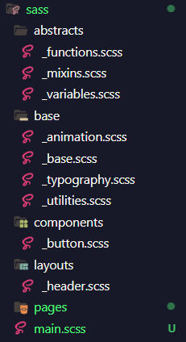
